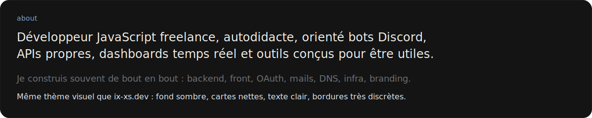
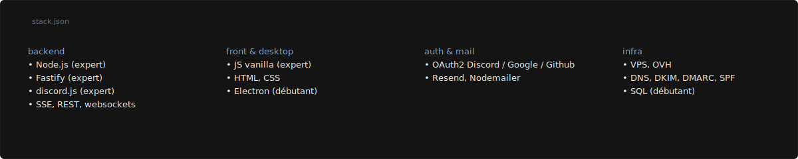
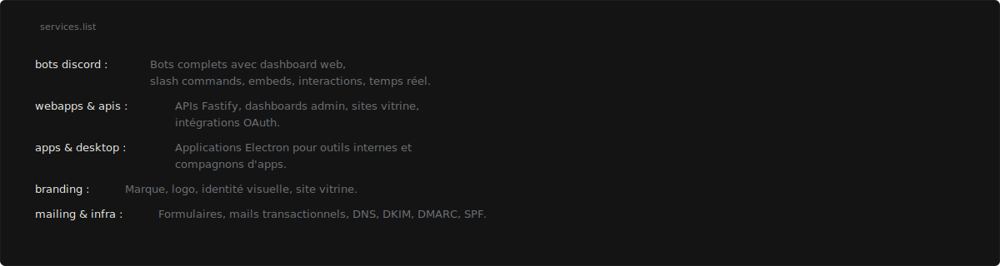
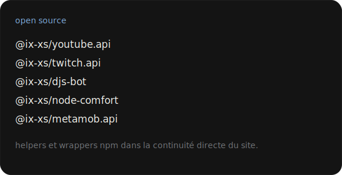
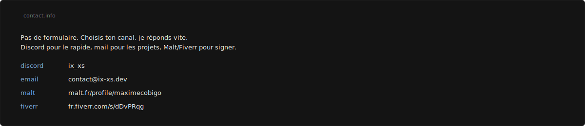

<div align="center">
  
</div>

<br>

<div align="center">
  
</div>

<br>

<div align="center">
  
</div>

<br>

<div align="center">
  
</div>

<br>

<div align="center">
  
</div>

<br>

<div align="center">
  
</div>

## Stack

```txt
backend   : node.js, fastify, discord.js
frontend  : javascript vanilla, html, css
desktop   : electron
realtime  : sse, websocket
auth      : oauth2
mail      : resend, nodemailer
infra     : vps, ovh, dns, dkim, dmarc, spf
```

## Liens

- Site : [ix-xs.dev](https://ix-xs.dev)
- Discord : `ix_xs`
- Email : [contact@ix-xs.dev](mailto:contact@ix-xs.dev)
- Malt : [malt.fr/profile/maximecobigo](https://malt.fr/profile/maximecobigo)
- Fiverr : [fr.fiverr.com/s/dDvPRqg](https://fr.fiverr.com/s/dDvPRqg)
